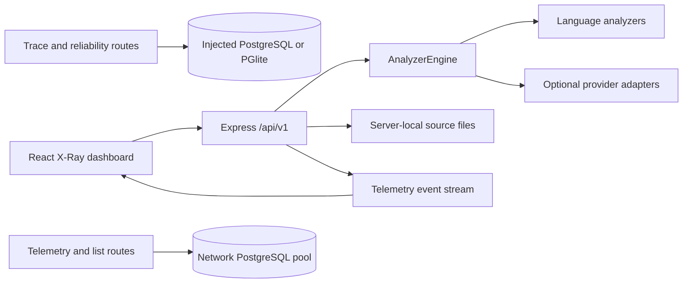

# Architecture

## Current application

`apps/web/src/main.tsx` mounts the React `XRayVision` dashboard. Vite serves it during development; Express serves `apps/web/dist` after a build. The API is created in `apps/api/src/app.ts`.

## Source analysis

The analyzer accepts in-memory files or a server-local path. It validates paths, discovers supported source files, reads content, runs language analyzers, optionally requests AI findings, merges findings, classifies severity, and builds diagnostics. Directory discovery is bounded to 50 files, with individual discovered file content truncated at 50,000 characters.

Python and JavaScript/TypeScript analyzers use text patterns and simple structural checks. They are not full language parsers. The health score deducts 25 points per critical finding and 8 per other finding, clamped to 0–100. A score of 100 is not proof that software is correct or secure.

Package analysis defaults to the Claude adapter unless a model is supplied. The orchestrator's general primary-provider selection prefers configured Claude, then OpenAI, then Gemini. Provider failures may return fallback results with zero AI findings, so stage completion alone does not verify a successful live API call.

The apply-fix endpoint performs predefined regular-expression substitutions and can write an existing file if requested. It then analyzes the result again; it does not run the target application's tests. The current Claude chat and issue-analysis/fix-plan implementations are canned responses; live package-analysis support is a separate path.

## Database modes

- `server.ts` uses the network PostgreSQL pool from `db.ts`. Run `pnpm db:setup` before starting it.
- `local.ts` creates PGlite at `.local/postgres`, runs the five migrations, and injects it into the cart, run, journey, and reliability services.
- The telemetry router and several `/api/v1` listing routes import the network pool directly. They do not automatically use the preview's embedded database. Failed list queries can return empty arrays.

The migrations define demonstration data, sessions, saved run/journey evidence, issues, and telemetry schemas. Network migrations use a transaction, an advisory lock, and a migration ledger.

## Retained trace and reliability demonstrations

Manual OpenTelemetry capture links the bundled cart's application and SQL operations. Runs have baseline/regressed/fixed variants with three executions and 2/21/2 queries per execution. Output digests help check equality. Connected journeys distinguish actual SQL failure from the HTTP response reported to the browser.

Trace histories are owned by six-hour guest sessions. Bounded JSONB evidence is persisted with terminal run state. Comparisons are computed from stored evidence, not persisted as a separate comparison table. Missing browser observations and incomplete captures remain explicit.

Reliability policies operate on controlled in-process modules; database probes execute real SQL. Recovery verification, approvals, rollback, and the kill switch are exercised by tests. These are not production restarts or general autonomous repairs.

The old UI components for these demonstrations remain in the repository but are not mounted by the current frontend entry point.

## Events, persistence, and boundaries

SSE uses one shared in-process client set. Analysis and remediation events update React state; that state is not a durable audit trail. Trace data persists in the database; Reliability Lab history is bounded in memory. Telemetry persistence depends on the network pool.

Source analysis can expose file contents to cloud providers and connected SSE clients. Trace-session guards do not protect the earlier-mounted telemetry and v1 routers. See [SECURITY.md](../SECURITY.md) before changing the network binding or deploying.

The runtime assumes a single application process per database for trace execution/recovery. Use the [deployment guide](../DEPLOYMENT.md) as preparation notes, not a production-readiness claim.
